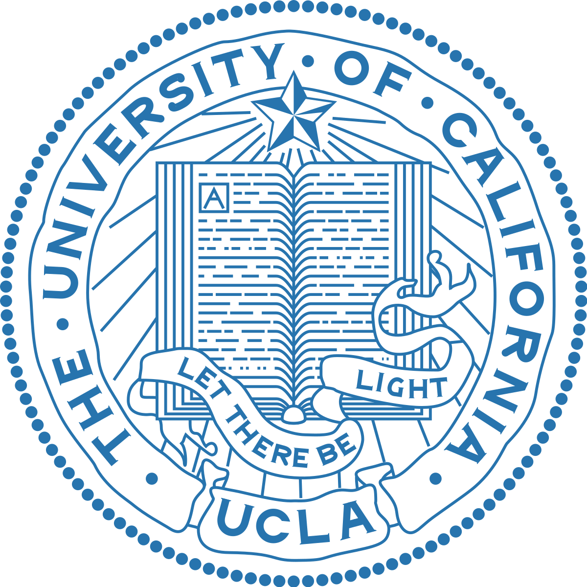

[![Contributors][contributors-shield]][contributors-url]
[![Forks][forks-shield]][forks-url]
[![Stargazers][stars-shield]][stars-url]

# UCLA-LACC-2019

[](https://github.com/Kaweees/UCLA-LACC-2019)

Slides and handouts for [UCLA LACC 2019](https://sites.google.com/site/computingcircle/2019-summer)

<!-- USAGE -->
## Usage

<p style="margin-right: 155px;">This repository serves as a place for me to store the slides and handouts of LACC and for later reference in future progress and the benefit of others. This is not of my creation. Each presentation in each module has the person who gave the presentation, who I assume is the creator of each presentation. The LACC summer program is a program maintained and organized by <a href="https://github.com/sandeep-iitr" target="_blank">Sandeep Singh Sandha</a>.</p>

<!-- MODULES -->
## Modules

Stored in chronological order of presentation.

```
.
├── 01 - Introduction Computer Science & Python
├── 02 - Algorithms
├── 03 - Website APIs & Databases
├── 04 - Mobile Development
├── 05 - Machine Learning & Artificial Intelligence
├── 06 - Social Networks
├── 07 - Internet of Things & Embedded System
└── 08 - Control Systems
```
<!-- CONTACT -->
## Contact

Sandeep Singh Sandha - [@sandeep-iitr](https://github.com/sandeep-iitr) - sandha@cs.ucla.edu

Miguel Villa Floran - [@kaweees](https://twitter.com/kaweees1) - miguelvillafloran@gmail.com

Project Link: [https://github.com/Kaweees/UCLA-LACC-2019](https://github.com/Kaweees/UCLA-LACC-2019)

## Support Us!
Give this repo a ⭐️ if you found this project helpful!

## Acknowledgements

-   [othneildrew's best readme template](https://github.com/othneildrew/Best-README-Template)

[contributors-shield]: https://img.shields.io/github/contributors/Kaweees/UCLA-LACC-2019.svg?style=for-the-badge
[contributors-url]: https://github.com/Kaweees/UCLA-LACC-2019/graphs/contributors
[forks-shield]: https://img.shields.io/github/forks/Kaweees/UCLA-LACC-2019.svg?style=for-the-badge
[forks-url]: https://github.com/Kaweees/UCLA-LACC-2019/network/members
[stars-shield]: https://img.shields.io/github/stars/Kaweees/UCLA-LACC-2019.svg?style=for-the-badge
[stars-url]: https://github.com/Kaweees/UCLA-LACC-2019/stargazers
